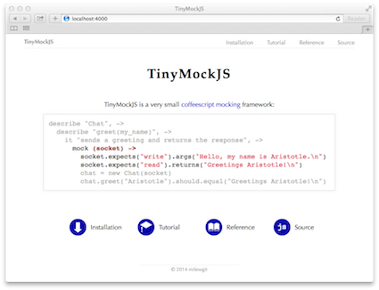

### What is TinyMockJS.doc?
The user documentation for TinyMockJS, a very small coffeescript mocking framework.

### What where?

- The TinyMockJS.doc site is [here](http://milewgit.github.io/TinyMockJS.doc/).
- The TinyMockJS source code is [here](https://github.com/milewgit/TinyMockJS).

### Development Setup

#####Requirements:
- [OS X](https://www.apple.com/osx/)
- [VMware Fusion](http://www.vmware.com/ca/en/products/fusion)
- [Vagrant](http://www.vagrantup.com)
- [Vagrant VMware provider](https://www.vagrantup.com/vmware)
- An OS X Vagrant box named OSX109 (you can use a different name by changing the BOX variable near the top of the Vagrantfile downloaded in the Install step below)

#####Install:
In a terminal window on the host machine:
```
$ mkdir -p ~/work/TinyMockJS.doc
$ cd ~/work/TinyMockJS.doc
$ curl -fsSL https://raw.github.com/milewgit/TinyMockJS.doc/gh-pages/Vagrantfile -o Vagrantfile
$ vagrant up --provider=vmware_fusion
...
```

#####Check installation:
In a terminal window on the vm (guest machine):
```
$ cd ~/Documents/TinyMockJS.doc
$ ./_watch
Started local web server at http://localhost:4000 and now watching for changes.
Press Ctrl-C to stop.

```
Open a browser on the vm, go to http://localhost:4000 and you should see the following:



#####Uninstall:
**WARNING**: This will completely destroy the vm so you likely want to ensure that you have 
pushed any and all code changes to GitHub beforehand.

In a terminal window on the host machine:
```
$ cd ~/work/TinyMockJS.doc
$ vagrant destroy -f
$ cd ~
$ rm -r ~/work/TinyMockJS.doc    # and possibly rm -r ~/work if it is now empty
```


#####Development Notes:
- TinyMockJS.doc is hosted on [GitHub pages](https://pages.github.com).  As a result, there is only one git 
branch, gh-pages.  To do a deploy, simply do 'git push'.

- ./_watch is a shell script that will launch both Sass and Jekyll in watch mode.  Run ./watch and
launch a browser pointing to http://localhost:4000.  As you make and save changes to the source 
files (e.g. index.html, style.scss), simply refresh the browser (Command-R, etc.) to immediately 
see the results of your changes.

- ./_build will invoke Sass to convert .scss files to .css files and will also run Jekyll to build
the site.  If you do not use ./watch, make sure you use ./build before 'git push' otherwise the .css 
files will get out of sync with the .scss files.

- All html, css, and svg files are in the root directory of the project.  Tried putting these files in
subdirectories (pages/, styles/, and images/) and while this worked locally it caused grief on
GitHub (result was a page 404 and no error messages or error emails).
  
- If you wish to modify the Vagrantfile, it is best to do so on the host machine (~/work/TinyMockJS.doc/Vagrantfile) 
so that you can easily do an edit/vagrant up/vagrant destroy cycle.  Once you have finished making 
changes, vagrant up and then in a terminal window on the vm do something like:
    ```
    $ cd ~/Documents/TinyMockJS.doc
    $ cp /vagrant/Vagrantfile .
    $ git status
    ...
    $ git add Vagrantfile
    $ git commit -S -m "Insert description of change to Vagrantfile here."
    ...
    $ git push
    ...
    ```


### Thanks
- [Apple](http://www.apple.com)
- [GitHub](https://github.com) and [GitHub pages](http://pages.github.com)
- [Bundler](http://bundler.io)
- [Jekyll](http://jekyllrb.com)
- [Sass](http://sass-lang.com)
- [TextMate](http://macromates.com)
- [Vagrant](https://www.vagrantup.com)
- [VMware](http://www.vmware.com)
